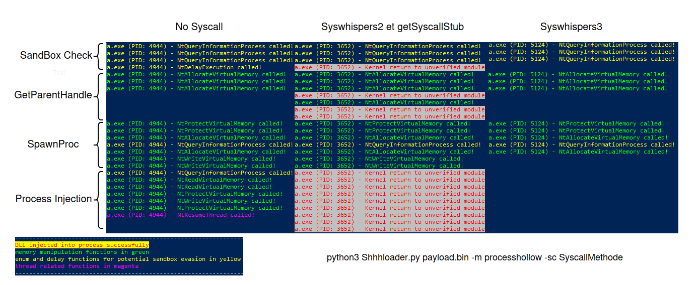

# MonitoringSyscall
A small tool to learn dll hooking and test syscall methods and their efficiency.

this program uses syscall-detect.dll from jackullrich (https://github.com/jackullrich/syscall-detect)


injector.exe injects edr.dll and syscall-detect.dll into the specified process.
edr.dll will hook a few function of ntdll.
syscall-detect.dll alert of kernel callback not in ntdll
listener.exe get informations through named pipe

For example, here is a test on a few different syscall options generated by https://github.com/icyguider/Shhhloader




## To compile on kali

Requirement :
```
apt install mingw
```

Compilation de injector.cpp : 
```
x86_64-w64-mingw32-g++ injector.cpp -s -w -std=c++17 -masm=intel -fpermissive -static -lntdll -lpsapi -Wl,--subsystem,console -o injector.exe
```


Compilation de listener.cpp : 
```
x86_64-w64-mingw32-g++ listener.cpp -s -w -std=c++17 -masm=intel -fpermissive -static -lntdll -lpsapi -Wl,--subsystem,console -o listener.exe
```

Compilation de edr.dll :
```
python3 gen_edr.py
```

Compilation of syscall-detect.dll :
syscall-detect.dll need to be compiled on windows
get the github open it in visual studio and replace the content of main.cpp by syscall-detect.cpp


## Use

Move edr.dll, listener.exe and injector.exe in the same folder on a windows machine.

Launch injector.exe and listener.exe, injector.exe takes one argument.


